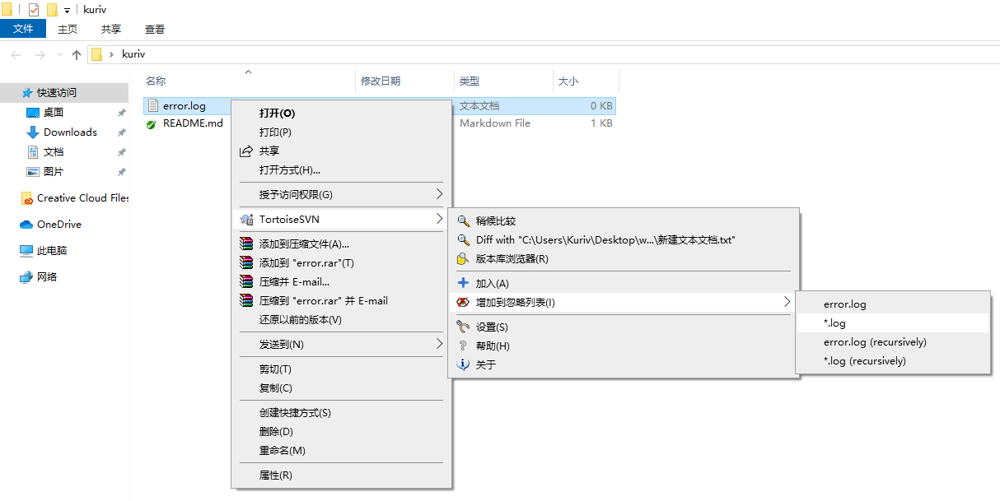

# 忽略文件

在多数项目中你总会有文件和目录不需要进行版本控制。这可能包括一些由编译器生成的文件，或者是一个用于存放可执行程序的输出文件夹。只要你提交修改，就会在提交对话框的文件列表中显示出未版本控制文件。当然你可以关闭这个显示，不过你可能会忘记添加新的源文件。最好的避免类似问题的方法是添加文件到该项目的忽略列表。这样他们就永远不会出现在提交对话框中，而真正的未被版本控制的文件则仍然列出。

