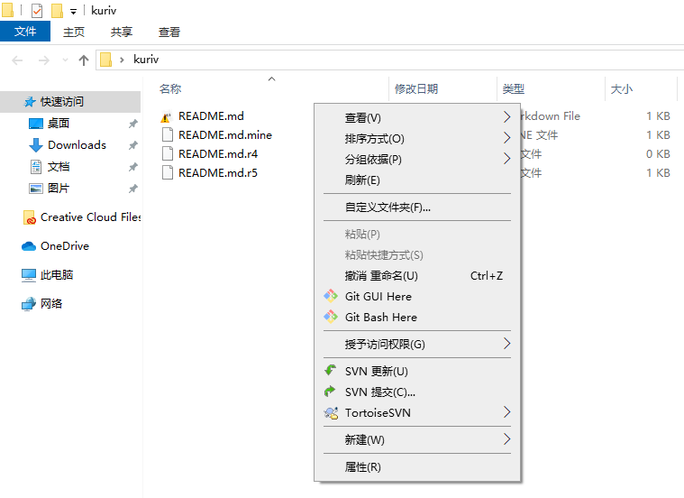

# 解决冲突

当两个或更多开发人员更改了文件的相同几行时，会发生文件冲突。由于 TortoiseSVN 对你的项目一无所知，因此它会将冲突解决给开发人员。 `README.md.mine` 是你的文件，在你更新你的工作副本之前存在于你的的工作副本中，也就是说，没有冲突标志，这个文件除了你的最新修改外没有别的东西。 `README.md.r4` 是在你更新你的工作副本之前的基础版本文件，它是在你做最后修改之前所检出的文件。 `README.md.r5` 这个文件是当你更新你的工作副本时，客户端从服务器接收到的，这个文件对应于版本库中的最新版本。

你可以使用任何文本编辑器手动解决冲突。你应该确定代码应该是什么样子，进行必要的更改并保存文件。然后，执行下面图片中的操作，并提交修改到版本库。需要注意的是下面图片中的操作并不是真正的解决了冲突，它只是删除了文件 `README.md.mine` 和 `README.md.r*` ，并允许你提交修改。

